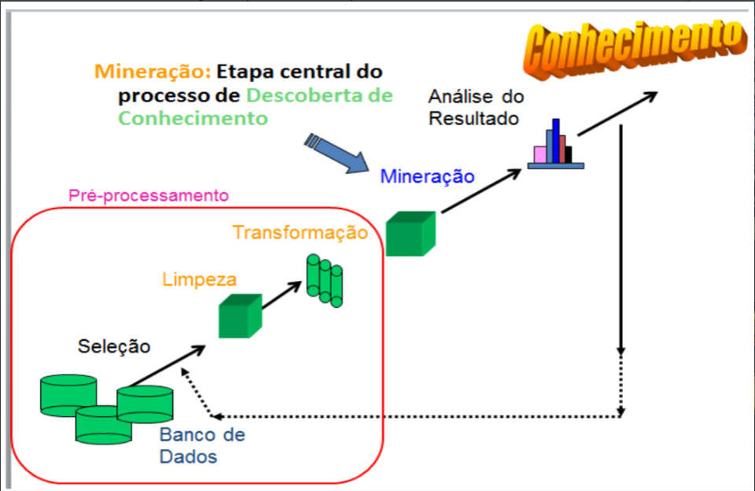
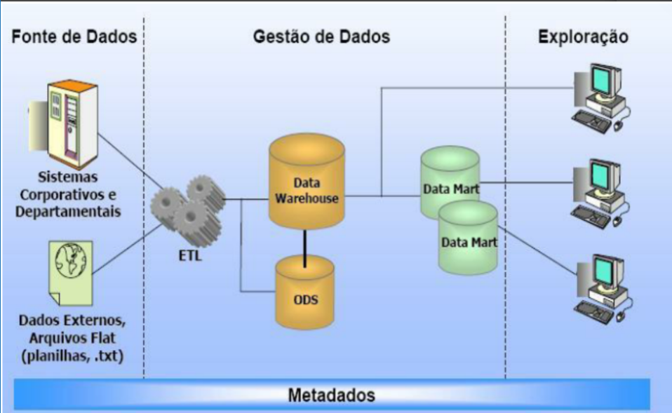
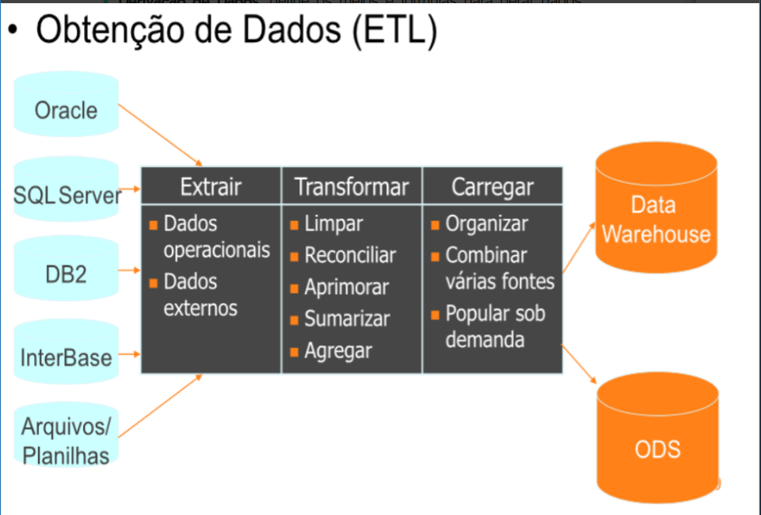

Diferença entre dado, informação e conhecimento

## Dado
É a menor unidade de armazenamento dentro de um banco de dados. É um aspecto que quando observado sozinho não tem significado. Para que haja compreensão do dado, é sempre necessário fazer o processamento, a realização de algum tipo de operação com o dado.
Exemplos:
- 21/08/2000
- 30 graus
- poucas

## Informação 
É o resultado de algum tipo de operação com o dado
  - data de nascimento: 21/08/2000
  - temperatura do ar: 30 graus
  - quantidade de nuvens no céu: poucas

## Conhecimento
Ocorre quando utilizamos a informação para chegar a alguma conclusão, ou até mesmo reconhecer algum tipo de comportamento e/ou padrão.

Através de análises estatísticas (média, contagem, valor máximo, valor mínimo, porcentagens, etc) chega-se ao conhecimento.

Por exemplo, existe um comportamento de ir a praia quando o dia está quente e a probabilidade de chuva é baixa.

Uma loja de roupas de praia, usando esse conhecimento, pode reforçar o seu estoque ou enviar promoções.

## Etapas do processo de descobrimento do conhecimento
Para chegar ao conhecimento, primeiro é necessário coletar dados. Depois, faz-se todo o processo de transformação desses dados, chegando até a mineiração, onde se realizam diversos tipos de análises para, então, alcançar o conhecimento.

## Planejamento da coleta de dados
A primeira fase tem como objetivo definir o escopo do projeto, preocupando-se em definir como será o desenvolvimento e quais setores serão impactados. Com essas respostas, poderemos determinar o que deverá ser realizado no projeto.

Para isso, utilizam-se habilidades de levantamento de dados e análise prévia. Ferramentas básicas de tecnologia como banco de dados, ferramentas de desenvolvimento OLAP (Online Analytical Processing) e processo de ETL deverão ser analisados, além das informações de negócio.

A qualidade e a integridade da fonte de dados devem ser analisadas com muita atenção, além do tempo histórico dos dados.

## A Coleta de Dados dentro do Processo ETL(C) – Extração, Transformação e Carga

Nesse momento, os significados de extração de dados e de seu tratamento podem ser divididos em:

- Filtro de dados -> relaciona os modos e situações para se eliminar os elementos de dados inconvenientes no modelo dimensional. Por exemplo, utilizar somente pedidos de vendas com valores acima de R$20.000,00 no projeto.

- Integração de dados -> define a forma de se concatenar informações existentes em fontes diferentes. A adaptação dessas informações torna-se essencial para os requisitos do sistema e deverá ser previsto nessa etapa.

- Condensação de dados -> define o molde de se diminuir volumes de dados visando obter informações resumidas e totalizadas. Por exemplo, resumir em valores semanais dados de compras diárias.

- Conversão de dados -> define métodos para se alterar dados em unidades, moldes e dimensões diferentes.

- Derivação de dados -> define os meios e fórmulas para gerar dados virtuais, a partir de dados presentes.

